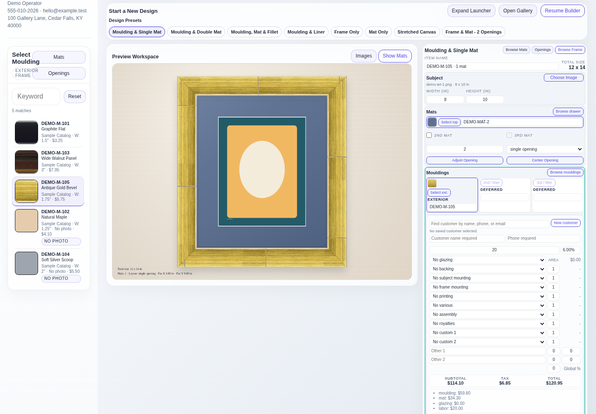
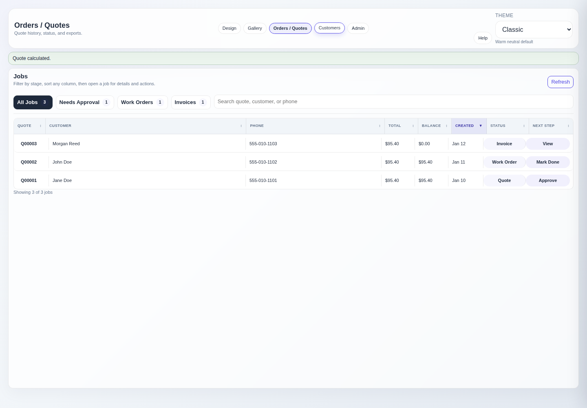

# FramersHaven

FramersHaven is a local-first workstation for custom framing shops. It combines artwork intake, visual design, material selection, quoting, production tracking, customer records, document previews, and backups in one browser-based application.

Current release candidate: **v0.2.0-rc1**. The application is ready for controlled evaluation. The packaged Windows workflow still requires a recorded test on a real Windows 10 or Windows 11 workstation before its final release.

The included demo uses the fictional **FramersHaven** identity and generated sample data. No customer records, vendor catalogs, or operational credentials are distributed with the repository.

## Features

- Live framing mockup with stacked mats and moulding previews
- Gallery intake with non-destructive crop metadata
- Searchable mats, mouldings, and glazing catalog
- Configurable pricing, services, tax, and studio branding
- Quote, work-order, and invoice workflow
- PDF/JPG preview before save or customer handoff
- Accounting CSV handoff bundle
- Optional Framewise assistant workflow for catalog-grounded framing suggestions
- Customer history and local backup archives
- Multi-page operator help served by the app

## Demo Screens

The screenshots below use only the included fictional demo workspace. They do
not contain real customer, vendor, or shop data.

### Framing design and live quote



### Jobs and quote workflow



## Community Edition

FramersHaven Community Edition is the full free local workstation. There are no
artificial catalog, quote/order, local package-import, backup, or accounting CSV
limits in the public app.

The optional **Framewise** assistant can be enabled from Admin and pointed at a
local or OpenAI-compatible provider such as Ollama, llama.cpp, LM Studio, or a
shop-managed endpoint. It defaults to a small local-model profile and remains
off until the operator enables it. With a vision-capable provider, the Design
workspace sends the selected artwork image for visual analysis before suggesting
catalog-grounded looks. When no model is configured, it still produces local
starter looks from the workstation catalog. The app does not ship model weights.

When an operator reviews and applies a Framewise look, the app can store an
optional reviewed example locally for future model tuning or export. Example
storage and export stay on the workstation. The local JSONL export should be
reviewed for operator-supplied artwork, customer, and catalog context before it
is shared.

Recommended local AI starter:

```bash
ollama run hf.co/ggml-org/SmolVLM2-2.2B-Instruct-GGUF:Q4_K_M
```

Development evals can sample real photo folders without adding those photos to
the repository:

```bash
venv/bin/python scripts/framewise_eval.py --image-dir /path/to/photos --count 24
```

The sampler spreads picks across folders first so one customer job or event
folder does not dominate the run. Add `--provider` when a local vision provider
is running to test model-guided suggestions instead of the built-in fallback.

No vendor catalogs, customer records, accounting credentials, or online billing flow are included in the repository. This is a local-first app. Accounting support is a local CSV handoff only; it does not provide accounting API sync. The app does not process payments or send email/SMS. Do not expose it directly to the public internet.

## Quick Start

Requires Python 3.11 or newer. The Windows installer below can install Python
3.12 when no compatible Python is present.

### Windows

On a fresh Windows 10 or Windows 11 machine, open PowerShell and run:

```powershell
$installer="$env:TEMP\FramersHaven-install.ps1"; Invoke-WebRequest https://raw.githubusercontent.com/wspotter/FramersHaven/main/install_windows.ps1 -OutFile $installer; & ([scriptblock]::Create((Get-Content -Raw $installer)))
```

This installs FramersHaven under `%LOCALAPPDATA%\FramersHaven`, uses an existing
Python 3.11 or newer installation, or installs Python 3.12 through `winget` only
when one is missing. It preserves existing FramersHaven data, starts the local
app, and opens `http://127.0.0.1:8000`.

If the installer download fails, use the manual fallback: download the
repository ZIP, unzip it, and double-click `run_windows.bat` in the extracted
folder.

See [Windows install](docs/WINDOWS_INSTALL.md) for details.

### macOS / Linux

```bash
python3 -m venv venv
./venv/bin/pip install -r requirements.txt
./venv/bin/python scripts/seed_demo.py
./scripts/run.sh
```

Open `http://127.0.0.1:8000`. The launcher defaults to `127.0.0.1`, so it is
available only on the local machine. To opt in to access from other computers
on a trusted private LAN, bind it to all network interfaces:

```bash
HOST=0.0.0.0 ./scripts/run.sh
```

## Development

```bash
./venv/bin/pip install -r requirements-dev.txt
./venv/bin/python -m playwright install chromium
node -c app/static/app.js
node --test app/src/*.test.js
./venv/bin/python -m compileall app tests scripts
./venv/bin/python -m pytest -q tests
```

With the app running against demo data:

```bash
./venv/bin/python scripts/browser_smoke.py --expected-edition community
./venv/bin/python scripts/generate_screenshots.py
```

## Login And Roles

FramersHaven includes a simple local workstation login so a shop can keep admin
tools away from normal counter use. First-run demo accounts are:

- `admin` / `admin` for catalog imports, pricing, backups, studio settings, and assistant setup
- `operator` / `operator` for design, gallery, customers, quotes, orders, and day-to-day counter work

Set `FRAMERSHAVEN_ADMIN_PASSWORD` and `FRAMERSHAVEN_OPERATOR_PASSWORD` before
first launch to seed different defaults. This is intended for a trusted
workstation or private LAN, not public internet hosting.

## Practical Capacity

The included SQLite backend is aimed at a single workstation or small private
LAN install. With the indexed list views in this release, it is expected to be
comfortable for thousands of customers and orders on ordinary shop hardware.
Orders and customers load in bounded result sets, so a shop with a long history
can search without forcing the browser to render every saved record at once.

Reasonable expectations:

- Demo/home shop: hundreds of quotes, customers, and catalog rows
- Busy independent shop: several thousand customers and orders
- Larger history: tens of thousands of records should still be searchable, but backups, exports, and full-history reports may take noticeably longer
- Multi-register concurrent shop: plan a future server database/backend instead of treating the local SQLite file as a shared enterprise system

## Data Safety

Runtime data is deliberately ignored by Git. `catalog_previews/` runtime content is ignored except sanitized `demo-*.jpg` fictional demo preview assets included with the app:

- `studio.db`
- `uploads/`
- `exports/`
- `backups/`
- `catalog_imports/`

The app is intended for a trusted workstation or private LAN. It includes simple local login, but does not provide internet-facing authentication hardening, TLS termination, payment processing, or automated message delivery. Do not expose it directly to the public internet.

## Documentation

- [Windows install](docs/WINDOWS_INSTALL.md)
- [Operator manual](docs/USER_MANUAL.md)
- [Feature ledger](docs/FEATURES.md)
- [API reference](docs/API.md)
- [Architecture](ARCHITECTURE.md)
- [Security policy](SECURITY.md)
- [Contributing](CONTRIBUTING.md)

## License

FramersHaven Community Edition is free to use under the
[FramersHaven Community License](LICENSE). Copyright and official project
identity are retained. Third-party dependencies and operator-supplied vendor
data remain under their own terms.
