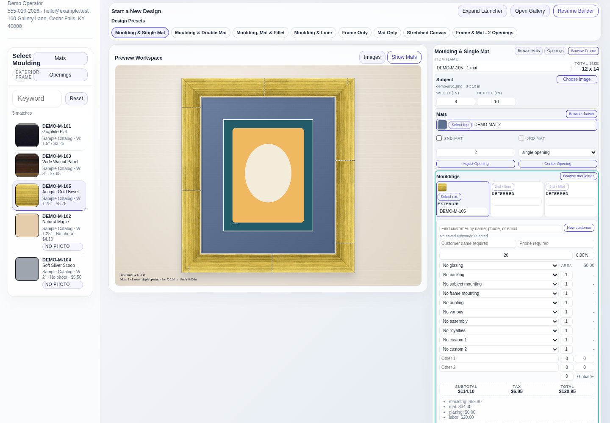
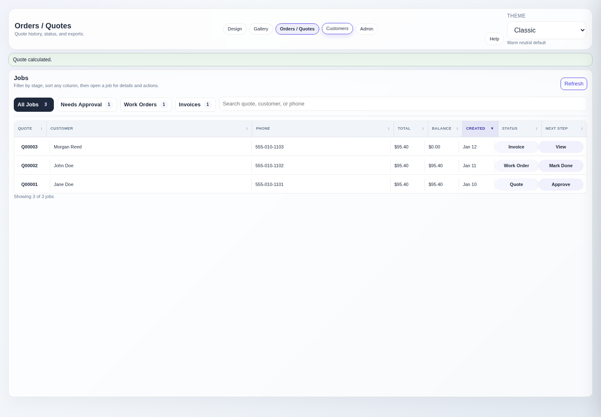

# FramersHaven

FramersHaven is a local-first workstation for custom framing shops. It combines artwork intake, visual design, material selection, quoting, production tracking, customer records, document previews, and backups in one browser-based application.

Current open preview: **v0.3.1-open-preview**. The one-file Windows installer is exercised on Windows CI and validated on a clean Windows 11 virtual machine.

The included demo uses the fictional **FramersHaven** identity and generated sample data. No customer records, vendor catalogs, or operational credentials are distributed with the repository.

## Features

- Live framing mockup with stacked mats and moulding previews
- Gallery intake with non-destructive crop metadata
- Searchable mats, mouldings, and glazing catalog
- Configurable pricing, services, tax, and studio branding
- Quote, work-order, and invoice workflow
- PDF/JPG preview before save or customer handoff
- Accounting CSV handoff bundle
- Optional Framewise assistant workflow for catalog-grounded framing suggestions
- Customer history and local backup archives
- Multi-page operator help served by the app

## Demo Screens

The screenshots below use only the included fictional demo workspace. They do
not contain real customer, vendor, or shop data.

### Framing design and live quote



### Jobs and quote workflow



## Community Edition

FramersHaven Community Edition is the full free local workstation. There are no
artificial catalog, quote/order, local package-import, backup, or accounting CSV
limits in the public app.

The optional **Framewise** assistant can be enabled from Admin and pointed at a
local or OpenAI-compatible provider such as Ollama, llama.cpp, LM Studio, or a
shop-managed endpoint. It defaults to a small local-model profile and remains
off until the operator enables it. With a vision-capable provider, the Design
workspace sends the selected artwork image for visual analysis before suggesting
catalog-grounded looks. When no model is configured, it still produces local
starter looks from the workstation catalog. The app does not ship model weights.

When an operator reviews and applies a Framewise look, the app can store an
optional reviewed example locally for future model tuning or export. Example
storage and export stay on the workstation. The local JSONL export should be
reviewed for operator-supplied artwork, customer, and catalog context before it
is shared.

Recommended local AI starter:

```bash
ollama run hf.co/ggml-org/SmolVLM2-2.2B-Instruct-GGUF:Q4_K_M
```

Development evals can sample real photo folders without adding those photos to
the repository:

```bash
venv/bin/python scripts/framewise_eval.py --image-dir /path/to/photos --count 24
```

The sampler spreads picks across folders first so one customer job or event
folder does not dominate the run. Add `--provider` when a local vision provider
is running to test model-guided suggestions instead of the built-in fallback.

No vendor catalogs, customer records, accounting credentials, or online billing flow are included in the repository. This is a local-first app. Accounting support is a local CSV handoff only; it does not provide accounting API sync. The app does not process payments or send email/SMS. Do not expose it directly to the public internet.

## Quick Start

FramersHaven opens directly into the studio. The installers create an isolated
Python environment, preserve existing workstation data, start the local app,
and open it in the default browser. Framewise AI is optional and is not
downloaded during the basic install.

### Windows

Download [FramersHaven-Setup.exe](https://github.com/wspotter/FramersHaven/releases/latest/download/FramersHaven-Setup.exe), open it, and finish setup.
The installer includes the application runtime, needs no Python or Git setup,
and does not require administrator rights. It adds a Start menu shortcut and
can add a desktop shortcut.

Windows may show a SmartScreen warning while this new application builds a
download reputation. Confirm the file came from the official FramersHaven
release, select **More info**, then **Run anyway**.

Program files are installed under `%LOCALAPPDATA%\Programs\FramersHaven`.
Customer data is kept separately under `%LOCALAPPDATA%\FramersHaven\Data` and
is preserved during upgrades and uninstall/reinstall. Existing data from the
earlier FramersHaven Windows installer is moved into this data folder on first
launch.

See [Windows install](docs/WINDOWS_INSTALL.md) for details.

### macOS and Linux

```bash
installer="$(mktemp)"; curl -fsSL https://raw.githubusercontent.com/wspotter/FramersHaven/main/install.sh -o "$installer" && bash "$installer"; rm -f "$installer"
```

The installer uses a compatible Python 3.11 or newer when available. If one is
not available, it uses `uv` to install a private Python 3.12 runtime for
FramersHaven without changing the system Python. On macOS it installs under
`~/Applications/FramersHaven`; on Linux it installs under
`~/.local/share/FramersHaven` and adds an application-menu launcher.

See [macOS install](docs/MAC_INSTALL.md) or
[Linux install](docs/LINUX_INSTALL.md) for restart and troubleshooting details.

### Optional Local AI

The basic app and Framewise catalog-grounded starter suggestions work without
Ollama. To let Framewise inspect artwork with the recommended local vision
model, follow [AI setup](docs/AI_SETUP.md). The AI setup is a separate,
explicit step and downloads no model until you run it.

### Localhost and Private LAN

The launchers default to `127.0.0.1`, so only the workstation can connect. If
port 8000 is busy, FramersHaven automatically tries the next available local
port and prints the address. To opt in to access from other computers on a
trusted private LAN, bind it to all network interfaces:

```bash
HOST=0.0.0.0 ./scripts/run.sh
```

## Development

```bash
./venv/bin/pip install -r requirements-dev.txt
./venv/bin/python -m playwright install chromium
node -c app/static/app.js
node --test app/src/*.test.js
./venv/bin/python -m compileall app tests scripts
./venv/bin/python -m pytest -q tests
```

With the app running against demo data:

```bash
./venv/bin/python scripts/browser_smoke.py --expected-edition community
./venv/bin/python scripts/generate_screenshots.py
```

## Local Workstation Use

FramersHaven opens directly into the studio workspace. It is intended for a
trusted workstation or private LAN where the shop controls access to the
computer itself. Admin tools are included in the free build so a shop can import
catalogs, adjust pricing, configure Framewise, and manage backups without a
separate license gate.

## Practical Capacity

The included SQLite backend is aimed at a single workstation or small private
LAN install. With the indexed list views in this release, it is expected to be
comfortable for thousands of customers and orders on ordinary shop hardware.
Orders and customers load in bounded result sets, so a shop with a long history
can search without forcing the browser to render every saved record at once.

Reasonable expectations:

- Demo/home shop: hundreds of quotes, customers, and catalog rows
- Busy independent shop: several thousand customers and orders
- Larger history: tens of thousands of records should still be searchable, but backups, exports, and full-history reports may take noticeably longer
- Multi-register concurrent shop: plan a future server database/backend instead of treating the local SQLite file as a shared enterprise system

## Data Safety

Runtime data is deliberately ignored by Git. `catalog_previews/` runtime content is ignored except sanitized `demo-*.jpg` fictional demo preview assets included with the app:

- `studio.db`
- `uploads/`
- `exports/`
- `backups/`
- `catalog_imports/`

The app is intended for a trusted workstation or private LAN. It does not
provide internet-facing authentication hardening, TLS termination, payment
processing, or automated message delivery. Do not expose it directly to the
public internet.

## Documentation

- [Windows install](docs/WINDOWS_INSTALL.md)
- [macOS install](docs/MAC_INSTALL.md)
- [Linux install](docs/LINUX_INSTALL.md)
- [Optional local AI setup](docs/AI_SETUP.md)
- [Operator manual](docs/USER_MANUAL.md)
- [Feature ledger](docs/FEATURES.md)
- [API reference](docs/API.md)
- [Architecture](ARCHITECTURE.md)
- [Security policy](SECURITY.md)
- [Contributing](CONTRIBUTING.md)

## License

FramersHaven Community Edition is free to use under the
[FramersHaven Community License](LICENSE). Copyright and official project
identity are retained. Third-party dependencies and operator-supplied vendor
data remain under their own terms.
